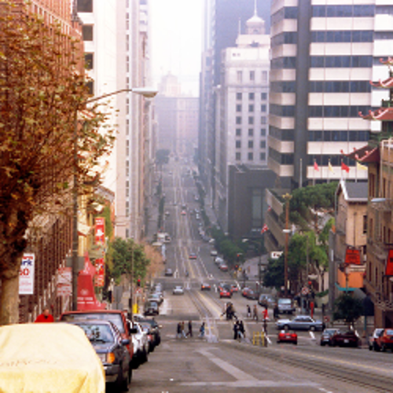
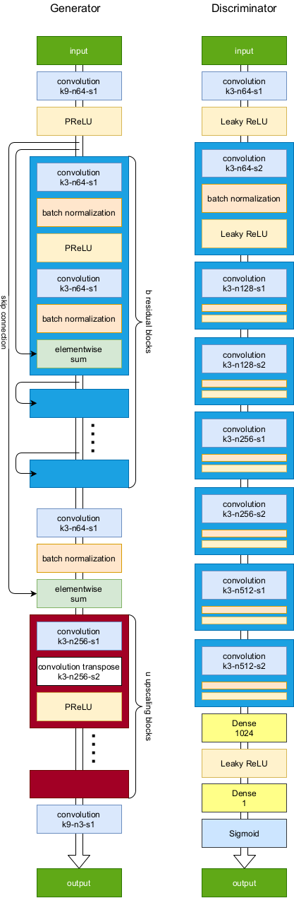

# UpscalingGAN
This repository contains a Image Upscaling project using a Generative Adversarial Network (GAN) model. 

image by Garry Miller

## Network Architecture
The DNN shown below is heavily inspired by <cite>Ledig et al. [1]</cite>. The GAN consists of two separate networks, which were trained to compete against each other.

The generator starts by utilizing a convolutional layer activated by PReLU. After that, it is followed by a series of **residual blocks**, which aim to remember the input of the network. After another convolutional layer the input will be added to the current state by a skip connection spanning over all residual blocks. Finally, the network uses a series of **upscaling blocks**, consisting of convolutional and conv. transpose layers followed by PReLU activation to perform the actuall upscaling process. Finally, another convolutional layer will be applied and generate the output image. The generator tries to recreate the full resolution image as exactly as possible from the low resolution image it gets as an input.

The discriminator starts with the same convolutional layers at the generator, activated by Leaky ReLU instead of PReLU. Afterwards it is followed by a series of convolution, batch normalization and Leaky ReLU activation blocks, varying in number of channels and stride size. Afterwards the images will run through a dense layer with the size of 1024, activated by Leaky ReLU and a dense layer of size 1, activated by Sigmoid. The discriminator then decides whether the input image was upscaled by the generator or is an original full resolution image.

All convolutional layers are described by a code consisting of **k** (kernel size), **n** (number of blocks) and **s** (stride size). Example: k9-n64-s1 describes a layer with a kernel size of 9x9, 64 channels and a stride of 1.

[1]: C. Ledig, L. Theis, F. Huszar, J. Caballero, A. P. Aitken,
A. Tejani, J. Totz, Z. Wang, and W. Shi, “Photo-realistic single
image super-resolution using a generative adversarial network,”
CoRR, vol. abs/1609.04802, 2016.
