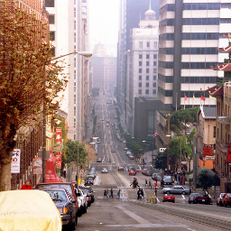

# UpscalingGAN
This repository contains an Image Upscaling project using a Generative Adversarial Network (GAN) model. 

image by Garry Miller

## Usage
### Inference
In order to try out our trained model, please unpack the `data/production_model/gen.tar.gz`archive by typing  

`$ tar xf gen.tar.gz`

in the command line. The path to the unpacked folder is defined in `src/config.py`. After unpacking, tensorflow is able to read the model from the `gen` folder and you can upscale an image by typing 

`$ python3 src/full_image_inference.py [image.jpg]`.

Note that `[image.jpg]` is a parameter and must contain a valid path to a jpg image. The output will be saved as `upscaled.jpg` in your current folder.

## Method
### Network Architecture
The DNN shown below is heavily inspired by <cite>Ledig et al. [1]</cite>. The GAN consists of two separate networks, which were trained to compete against each other.

The generator starts by utilizing a convolutional layer activated by PReLU. After that, it is followed by a series of **residual blocks**, which aim to remember the input of the network. After another convolutional layer, the input will be added to the current state by a skip connection spanning over all residual blocks. Finally, the network uses a series of **upscaling blocks**, consisting of convolutional and conv. transpose layers followed by PReLU activation to perform the actual upscaling process. Finally, another convolutional layer will be applied and generate the output image. The generator tries to recreate the full resolution image as exactly as possible from the low-resolution image it gets as an input.

The discriminator starts with the same convolutional layers at the generator, activated by Leaky ReLU instead of PReLU. Afterward, it is followed by a series of convolution, batch normalization, and Leaky ReLU activation blocks, varying in the number of channels and stride size. Finally, the images will run through a dense layer with the size of 1024, activated by Leaky ReLU, and a dense layer of size 1, activated by Sigmoid. The discriminator then decides whether the input image was upscaled by the generator or is an original full resolution image.

All convolutional layers are described by a code consisting of **k** (kernel size), **n** (number of blocks) and **s** (stride size). Example: k9-n64-s1 describes a layer with a kernel size of 9x9, 64 channels, and a stride of 1. 

## Experiments

### Training

We trained our networks on a NVIDIA RTX 3090 GPU with 24 GB of memory. First of all, the paths of the dataset images were read and then shuffled with a large enough buffer size. After shuffling, the images were loaded and modified by flipping, cropping, darkening, changing the saturation and brightness with a certain probability. Finally, after the images were modified, we create full and low-resolution pairs by resizing the original images. We chose the number of upscaling blocks u = 2, which leads to an upscaling factor of 2^u = 4. The low-resolution images with the size 64 by 64 pixels are upscaled to full resolution images with the size 256 by 256 pixels.
The optimizer we chose was Adam with ß1 = 0.9, as proposed by Ledig et al.[1] The learning rate was set to 10⁻⁴, and we trained the network for 10³ iterations.
The number of residual blocks was set to b = 8 in order to decrease training effort. 
After encountering a memory problem that leads our GPU's memory usage to increase over time and eventually cause allocation errors, we restructured our training loop and chose to load and save our network after each training iteration. 
After each iteration, one test sample was upscaled by the network to visualize training progress.
This was the only practical way to train the network for a decent number of iterations. One training iteration took approximately 800 seconds. The training of 1000 iterations took about 220 hours in total.

[1]: C. Ledig, L. Theis, F. Huszar, J. Caballero, A. P. Aitken,
A. Tejani, J. Totz, Z. Wang, and W. Shi, “Photo-realistic single
image super-resolution using a generative adversarial network,”
CoRR, vol. abs/1609.04802, 2016.
